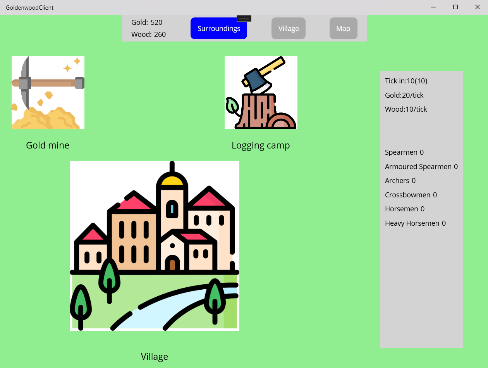
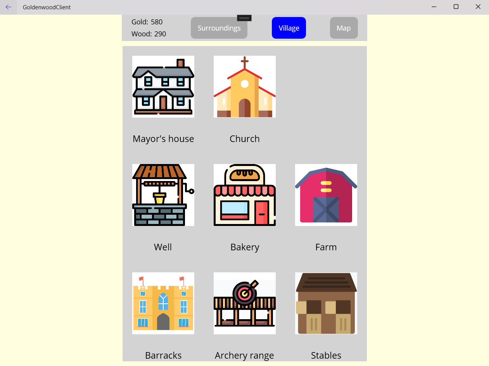
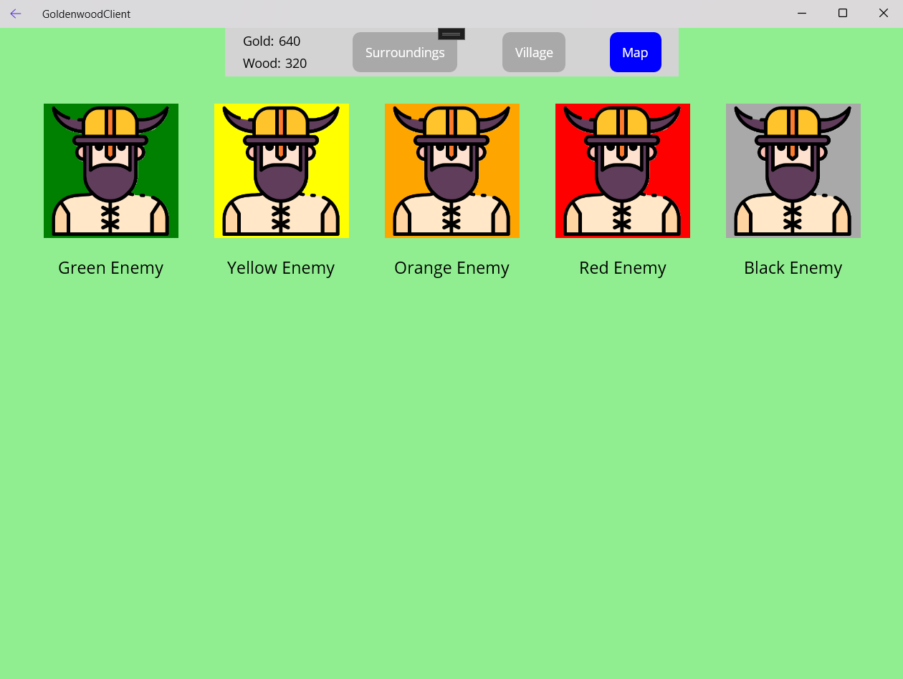

# Game Description
Goldenwood is a singleplayer strategic web game inspired by [Travian](https://www.travian.com), [Ikariam](https://www.ikariam.com), [Divoké kmeny](https://www.divokekmeny.cz) and other web games where you manage your village, build units and send them to fight other players.

The game is written in C#. It uses ASP.NET to build its API, Entity Framework to communicate with SQLite DB, and .NET MAUI for the client.

## Game Views

In the game, there are three views:

1, **Village surroundings view** - you can see the stats of your village and upgrade the buildings responsible for the production of gold & wood. You can also recruit military units here.    
      

2, **Village view** - you can build buildings that can further improve your income (or reduce the time needed to receive resources) or allow you to recruit new, better units.    
      

3, **Neighbourhood Map view** - You can see other villages here that you can fight. Your income generation will be boosted after winning a fight with an enemy village.     
      

# Running the game

## Necessary Tools

1, Download and install [Visual Studio](https://visualstudio.microsoft.com/).

2, Open the project solution ([Goldenwood.sln](./Goldenwood.sln) file in the root folder) in Visual Studio.

3, Install all the Visual Studio extensions that the Visual Studio advises you to install.

## Running the API

1, Open the console and go to the [GoldenwoodApi folder](./GoldenwoodApi).

2, Run the command `dotnet run`.

3, **Alternatively**, you can run the API using Visual Studio.

## Running the client

1, [Allow Developer Mode](https://learn.microsoft.com/en-us/windows/apps/get-started/enable-your-device-for-development) in your Windows OS settings.

2, Open Visual Studio, build and run the client.

## Running the tests

1, Open Visual Studio and run the tests there.
